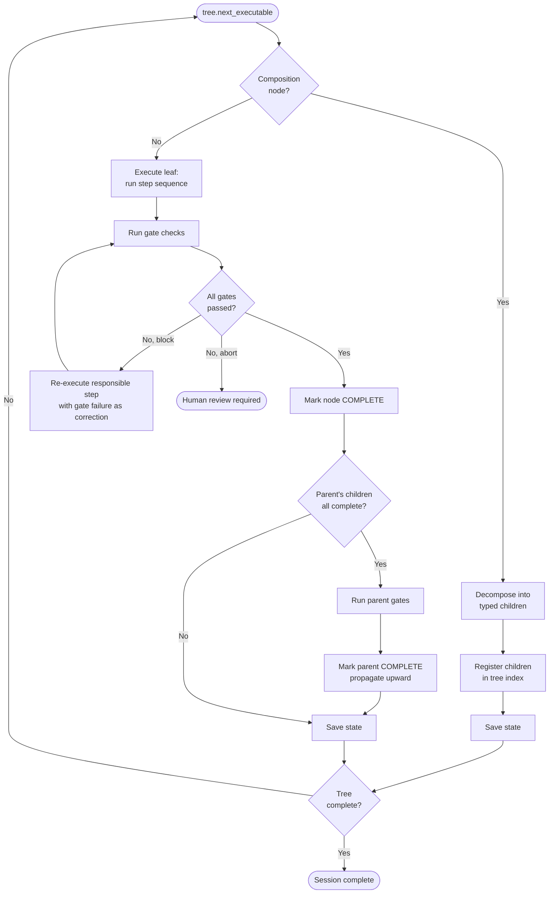
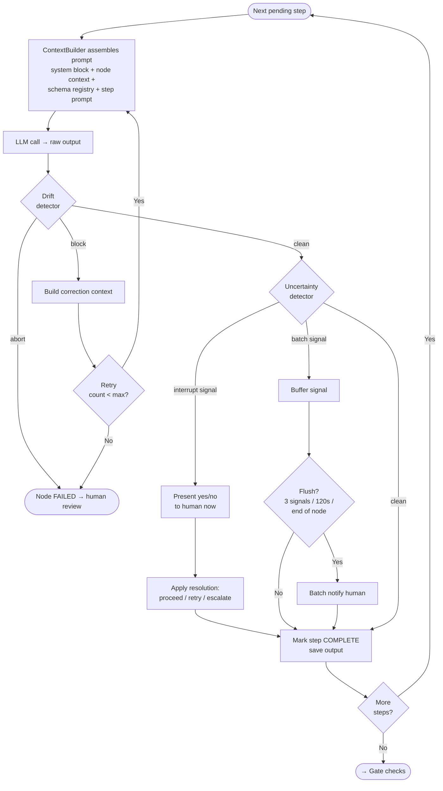

# Fractal LLM Coding System

A structured execution framework for LLM-driven software development that enforces process compliance, detects drift, and escalates ambiguity to humans rather than silently resolving it.

Built on top of the [superpowers](https://github.com/obra/superpowers) methodology.

---

## The problem this solves

LLMs drift. Not randomly — in predictable patterns. They skip steps when they recognize a familiar problem shape. They dilute early instructions as context grows. They declare completion before gates are satisfied. They substitute what they think you want for what you actually asked for.

The standard response to this is better prompting. This system takes a different position: the prompt alone can never be the enforcement mechanism. You need software that controls execution, not just text that requests it.

The core idea is that before a coding task begins, the system generates a typed decomposition tree. Every node in that tree has a fixed set of required steps and completion gates derived from its type — not from the LLM. The LLM fills in content. The runner controls shape, order, and completion.

The fractal part: composition nodes (orchestrations, pipelines) decompose into child nodes before executing. Those children may themselves be compositions. The tree bottoms out at leaf primitives, which are the only nodes that produce implementation. Work flows upward only after children are complete and gated.

---

## Documents

### Architecture

- [System architecture](./docs/architecture.md) — component map, data flow, layer responsibilities
- [Design principles](./docs/design-principles.md) — the reasoning behind the key decisions

### Core concepts

- [Primitive type taxonomy](./docs/primitives.md) — the 22 closed-set types all programming tasks decompose into
- [Task node schema](./docs/task-node-schema.md) — the data structure at the center of everything
- [Step templates](./docs/step-templates.md) — per-type ordered step sequences the runner enforces
- [Gate system](./docs/gates.md) — completion checks that run after every node

### Drift and uncertainty

- [Drift detection](./docs/drift-detection.md) — the five drift types, how each is detected, how each is corrected
- [Uncertainty and human-in-the-loop](./docs/uncertainty-hitl.md) — the third signal state, batching policy, notification UI, timeout behavior
- [Drift log and calibration](./docs/drift-log.md) — how resolution records feed back into detector improvement

### Execution

- [Runner loop](./docs/runner.md) — the traversal algorithm, step execution, signal routing
- [Planner](./docs/planner.md) — how a raw task description becomes a typed node tree
- [State and persistence](./docs/state.md) — serialization, session resumption, context injection

### Implementation

- [Project structure](./docs/project-structure.md) — file layout and module responsibilities
- [Implementation status](./docs/implementation-status.md) — what exists, what's next

---

## Execution cycles

### Top level: the tree traversal loop

The runner picks the next executable node, executes it (or decomposes it), runs gates, and saves state. This repeats until the root completes or a human must intervene.



### One level down: the step execution loop

Inside each leaf node, steps execute in fixed order. Each step goes through LLM generation, drift detection, uncertainty routing, and completion. This is where the system enforces process on the LLM.



---

## Quick orientation

The system has three layers that never mix:

**Schema layer** — defines what things are. `PrimitiveType`, `TaskNode`, `StepTemplate`, `GateTemplate`, `DriftSignal`, `UncertaintySignal`. Pure data. No LLM calls, no I/O.

**Detector layer** — examines LLM output and produces signals. Returns `DriftSignal` (confident something is wrong) or `UncertaintySignal` (might be wrong). Never takes action itself.

**Runner layer** — executes the tree. Makes LLM calls. Routes signals to corrections, human review, or continuation. Controls all state transitions.

The LLM is a content generator that operates inside constraints set by the other three layers. It fills in names, descriptions, implementations, and test code. It never controls its own step sequence, gate criteria, or completion status.

---

## Worked example

Task: "user can reset their password"

The planner classifies this as an `ORCHESTRATION`. That triggers the orchestration step template: enumerate children, define sequencing, define rollback, write integration tests. The children might be:

```
orchestration: password_reset_flow
  ├─ data_model: PasswordResetToken
  ├─ transformation: generate_reset_token
  │   ├─ unit_test: token_uniqueness
  │   └─ unit_test: token_expiry
  ├─ mutation: persist_reset_token
  ├─ mutation: send_reset_email
  ├─ query: find_token_by_value
  ├─ validation: validate_reset_request
  ├─ mutation: update_password_hash
  └─ integration_test: reset_flow_end_to_end
```

Each leaf node gets its type's step template. `generate_reset_token` is a `TRANSFORMATION` so the runner enforces: define input schema → define output schema → enumerate edge cases → write failing tests → implement minimal → refactor. In that order. With gates after: no Any types, no I/O calls, tests pass, minimum 3 edge cases covered.

If the LLM writes I/O code during the transformation's implement step, the gate catches it. If it skips the edge case enumeration step and goes straight to tests, phase drift detection catches it. If it declares the node complete before tests pass, completion drift catches it. If there's a new symbol in the output that wasn't in the node spec but might be a legitimate helper, an uncertainty signal fires and the human gets a specific yes/no question before the runner proceeds.
